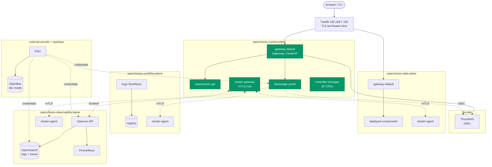

# 22 — OpenChoreo

[OpenChoreo](https://openchoreo.dev) v1.2.1 — an open-source internal
developer platform: a Backstage portal, a CRD-driven control plane, in-cluster
builds, and logs/traces/metrics, deployed as **20 Fleet paths** across seven
namespaces.

This is the largest bundle in the repo, and the only one that is a whole
platform rather than an application. It is also a **fresh install, not an
adoption** — nothing here existed on the cluster beforehand, so Fleet deploys
the moment a path lands.

| | |
|---|---|
| Portal | [openchoreo.ash4d.com](https://openchoreo.ash4d.com) (Backstage) |
| API / CLI | [api.openchoreo.ash4d.com](https://api.openchoreo.ash4d.com) |
| Identity | [thunder.ash4d.com](https://thunder.ash4d.com) (ThunderID, OIDC) |
| Observer | [observer.openchoreo.ash4d.com](https://observer.openchoreo.ash4d.com) |
| Workloads | `*.apps.openchoreo.ash4d.com` |

## Architecture on one node

OpenChoreo is designed as four planes across as many clusters. This is the
supported **single-cluster** topology: four planes, one node, separated by
namespace and by agent rather than by machine.



**Every hostname terminates at Traefik, not at a kgateway LoadBalancer.** The
OpenChoreo charts only speak Gateway API, so kgateway has to do the host
routing — but MetalLB's `lan-pool` had five free addresses when this was
written, and giving each plane's Gateway one would have taken three of them
for no benefit. `kgateway-params/` forces every Gateway Service to ClusterIP
and Traefik fronts all of them. That is the single biggest deviation from
upstream's install and the reason several values files disagree with the
upstream reference.

## Install order

Paths are added to the `lab-openchoreo` GitRepo **one at a time**, in this
order. Nothing here is an adoption, so each path deploys as soon as it lands.

| # | Path | Namespace | Notes |
|---|---|---|---|
| 1 | `22-openchoreo/external-secrets` | `external-secrets` | owns CRDs |
| 2 | `22-openchoreo/openbao` | `openbao` | dev mode — read its `fleet.yaml` |
| 3 | `22-openchoreo/secret-store` | `openbao` | needs 1 + 2 live |
| 4 | `22-openchoreo/kgateway-crds` | `openchoreo-control-plane` | owns CRDs |
| 5 | `22-openchoreo/kgateway-params` | `openchoreo-control-plane` | before 6 |
| 6 | `22-openchoreo/kgateway` | `openchoreo-control-plane` | |
| 7 | `22-openchoreo/control-plane-extras` | `openchoreo-control-plane` | **before 8** |
| 8 | `22-openchoreo/control-plane` | `openchoreo-control-plane` | owns 36 CRDs |
| — | *bootstrap: copy the cluster-gateway CA* | | **see below** |
| 9 | `22-openchoreo/thunder` | `thunder` | after the CP Gateway exists |
| 10 | `22-openchoreo/data-plane` | `openchoreo-data-plane` | |
| 11 | `22-openchoreo/data-plane-extras` | `openchoreo-data-plane` | wildcard cert for workloads |
| 12 | `22-openchoreo/workflow-registry` | `openchoreo-workflow-plane` | before 13 |
| 13 | `22-openchoreo/workflow-plane` | `openchoreo-workflow-plane` | build load — see its `fleet.yaml` |
| 14 | `22-openchoreo/observability-extras` | `openchoreo-observability-plane` | **before 15** |
| 15 | `22-openchoreo/observability-plane` | `openchoreo-observability-plane` | |
| 16 | `22-openchoreo/observability-logs` | `openchoreo-observability-plane` | OpenSearch — heaviest |
| 17 | `22-openchoreo/observability-traces` | `openchoreo-observability-plane` | needs 16 |
| 18 | `22-openchoreo/observability-events` | `openchoreo-observability-plane` | needs 16 |
| 19 | `22-openchoreo/observability-metrics` | `openchoreo-observability-plane` | **riskiest — see its `fleet.yaml`** |
| 20 | `22-openchoreo/registration` | cluster-scoped | **last** |

Three orderings are hard rather than preferences:

- **`control-plane-extras` before `control-plane`**, and **`observability-extras`
  before `observability-plane`**. Both charts hard-fail their *render* when
  `backstage.secretName` / `observer.secretName` is empty, and those Secrets
  come from the `-extras` bundles. The failure is on the Fleet controller, not
  the cluster.
- **`observability-logs` before `traces` and `events`.** Both write into the
  OpenSearch that `observability-logs` runs and bring none of their own.
- **`registration` last.** It references a `cluster-agent-tls` Secret in each
  plane's namespace, which does not exist until that plane's chart has run.

### There is no `22-openchoreo` path

Every path above is listed individually and `22-openchoreo` itself is **never**
in `spec.paths`. That is deliberate: FLEET-WIRING.md records that a nested
`fleet.yaml` deploys as soon as its *parent* path is adopted, so adding the
parent here would deploy all twenty bundles at once — the opposite of a staged
rollout. The directory has no `fleet.yaml` of its own precisely so that cannot
happen by accident.

## Prerequisites

### Already satisfied on this cluster

- **Gateway API v1.5.1, standard channel** — exactly what OpenChoreo v1.2
  wants. **Do not run upstream's `kubectl apply .../standard-install.yaml`
  step.** These CRDs are owned by the k3s-bundled `traefik-crd` release in
  `kube-system` with `helm.sh/resource-policy: keep`. Reinstalling them aims
  Fleet at k3s's own objects — the `03-gpu/runtimeclass` failure mode, with
  every Ingress in the cluster as the blast radius.
- **cert-manager v1.20.2 + the `letsencrypt-dns` ClusterIssuer** (15). Newer
  than the v1.19.4 upstream pins. Issues all three Ingress certificates and
  the internal CAs the plane agents use for mTLS.
- **Longhorn** — 428 GiB available of 1049 GiB (2026-07-30). This bundle
  claims ~34 GiB: OpenSearch 8Gi, Prometheus 6Gi, registry 20Gi.

> ⚠️ **Two default StorageClasses.** `local-path` and `longhorn` are *both*
> annotated `storageclass.kubernetes.io/is-default-class: true`. An unset
> `storageClassName` is therefore genuinely ambiguous on this cluster, which
> is why every PVC in this bundle names `longhorn` explicitly. Worth fixing at
> the cluster level, separately from OpenChoreo.

### DNS — satisfied, verified 2026-07-30

All five hostnames resolve to **192.168.7.150** (Traefik):

```
openchoreo.ash4d.com            A   192.168.7.150   # portal
api.openchoreo.ash4d.com        A   192.168.7.150   # API / CLI
thunder.ash4d.com               A   192.168.7.150   # OIDC
observer.openchoreo.ash4d.com   A   192.168.7.150   # covered by the wildcard
*.openchoreo.ash4d.com          A   192.168.7.150   # wildcard
```

**The wildcard answers at arbitrary depth**, not just one label —
`q.r.openchoreo.ash4d.com` and `q.apps.openchoreo.ash4d.com` both resolve.
That is why deployed components live at `*.apps.openchoreo.ash4d.com` and need
no record of their own.

The nested `apps.` label is a deliberate choice, not cosmetics: the wildcard
would serve `<component>.openchoreo.ash4d.com` just as well, but then a
developer naming a component `api` or `observer` would mint a hostname that
collides with the control plane's, and which Ingress Traefik picks is
undefined. **Nobody should be able to shadow the control plane by choosing a
component name.**

An earlier draft of this bundle used a separate `*.openchoreoapis.ash4d.com`
zone for workloads. It was dropped once the existing wildcard turned out to
cover the need — one fewer DNS record to maintain.

**No hand-created Secrets.** Unlike every other bundle in this repo, there is
nothing to `kubectl create secret` — OpenBao seeds itself and ESO materialises
the rest. See "Credentials" below for the tradeoff that buys.

## Bootstrap: propagating the cluster-gateway CA

**The one manual step, and the most likely thing to go wrong.**

Each plane's `cluster-agent` verifies the control plane's `cluster-gateway`
against a ConfigMap named `cluster-gateway-ca` **in its own namespace**. The CA
is minted by cert-manager in `openchoreo-control-plane` and does not exist
until path 8 has run — so it cannot be committed here.

Run this once, after path 8 and before the plane agents start (paths 10, 13, 15):

```bash
CA=$(kubectl -n openchoreo-control-plane get secret cluster-gateway-ca \
       -o jsonpath='{.data.ca\.crt}' | base64 -d)

for ns in openchoreo-data-plane openchoreo-workflow-plane openchoreo-observability-plane; do
  kubectl create namespace "$ns" --dry-run=client -o yaml | kubectl apply -f -
  kubectl create configmap cluster-gateway-ca --from-literal=ca.crt="$CA" \
    -n "$ns" --dry-run=client -o yaml | kubectl apply -f -
done
```

**Symptom if you skip it:** the agent pod sits in `ContainerCreating` with a
`MountVolume.SetUp failed ... configmap "cluster-gateway-ca" not found` event.
Not a crashloop, and nothing in the OpenChoreo logs mentions it.

Redo it if the control plane's `cluster-gateway-ca` Certificate is ever
reissued — the ConfigMap is a copy, not a reference, and nothing re-syncs it.

*Registration*, by contrast, **is** declarative: the v1.2.1 CRDs accept
`clientCA.secretKeyRef` with a cross-namespace `namespace`, so `registration/`
references each plane's CA instead of inlining PEM the way upstream's
installer does. That is why there is one bootstrap step here and not four.

## Credentials

> 🔴 **`thunder/values.yaml` and `openbao/values.yaml` carry real credential
> values. They are the only two files in this repo that do, and that is a
> deliberate, bounded exception to the repo's sanitization rule.**

They are OpenChoreo's **upstream fixture credentials** — published in
`github.com/openchoreo/openchoreo`, identical in every k3d quickstart
(`backstage-portal-secret`, `openchoreo-rca-agent-secret`,
`ThisIsTheOpenSearchPassword1`, …). Committing them leaks nothing that is not
already public.

They are still real confidential-client secrets for *this* deployment. What
makes that acceptable here and nowhere else: **all five OpenChoreo hostnames
are public DNS records resolving to 192.168.7.150, a LAN address.** None of it
is reachable from the internet — the same pattern every other `ash4d.com`
service in this repo uses.

Why they are literals rather than `secretKeyRef`s: each value must byte-match
on both sides of an OIDC handshake, and Thunder's half lives inside a 34 KB
bootstrap shell script in its own values file. Parameterising one side without
the other moves the problem rather than solving it.

### Rotating the fixture credentials

Do this before exposing any of these hostnames beyond the LAN. Each value must
change in **both** files or the handshake breaks:

| Value | `thunder/values.yaml` | `openbao/values.yaml` |
|---|---|---|
| Backstage OIDC | `openchoreo-backstage-client` `client_secret` | `secret/backstage-client-secret` |
| Observer OIDC | `openchoreo-observer-resource-reader-client` | `secret/observer-oauth-client-secret` |
| RCA agent | `openchoreo-rca-agent` | `secret/rca-oauth-client-secret` |
| FinOps agent | `openchoreo-finops-agent` | `secret/finops-agent-oauth-client-secret` |
| Backstage session | — | `secret/backstage-backend-secret` |

Then restart OpenBao (dev mode reseeds on start) and delete the ExternalSecrets
so they re-resolve immediately rather than at the 1 h refresh.

**The OpenSearch password is the exception — it is write-once.** OpenSearch
seeds its security index from `OPENSEARCH_INITIAL_ADMIN_PASSWORD` on *first
start only*. Changing it in `openbao/values.yaml` rotates what every client
presents but not what OpenSearch accepts, leaving a cluster nothing can log
into. Rotating it properly means an OpenSearch-side password change, or
deleting its PVC and reindexing.

## What does not survive a restart

This deployment deliberately runs three components without persistence.
Knowing which is which matters more here than in any other bundle:

| Component | Storage | Lost on restart | Consequence |
|---|---|---|---|
| **OpenBao** | none (dev mode) | everything not in `values.yaml` | ⚠️ **secrets you create through the OpenChoreo UI are gone.** Fixtures reseed automatically |
| **Thunder** | in-pod SQLite | users/clients you add by hand | fixture users and OIDC clients are recreated by its bootstrap Job |
| **Backstage** | in-pod SQLite | catalog cache | none — rebuilt from the API within 300 s |
| OpenSearch | 8Gi Longhorn | — | persists |
| Prometheus | 6Gi Longhorn | — | persists (3 d retention) |
| registry | 20Gi Longhorn | — | persists |

OpenBao in dev mode is the deliberate trade documented in
`openbao/values.yaml`: file storage persists but **seals on every restart**,
and there is no auto-unseal without a KMS. On an unattended single-node lab,
"reseeds itself" beats "persists but needs a human to type unseal keys before
the portal works again". **Do not use this deployment's secret management for
anything you cannot recreate.**

## Resource footprint

sdf1 was at **74% memory (48 GiB of 64 GiB)** and ~50% CPU requests when this
was written, already running ollama on the V100, milvus, emby and the k3s
control plane. Rough budget for the full stack:

| Group | Memory |
|---|---|
| Prereqs (ESO, OpenBao, kgateway) | ~0.5 GiB |
| Control plane + Thunder | ~1.5 GiB |
| Data + workflow planes (idle) | ~0.5 GiB |
| Observability plane + observer | ~0.5 GiB |
| **OpenSearch** | **~2 GiB** |
| **Prometheus** (path 19) | **~1–2 GiB** |

**Enable paths 16–19 one at a time and check `kubectl top node` between each.**
If it gets tight, drop in this order: `observability-metrics` (Rancher's
Prometheus already covers the cluster; you lose one portal tab), then
`observability-traces` (collects nothing until something is instrumented).

`workflow-plane` is the one bundle that can destabilise the node *dynamically*
— builds are transient and CPU-hungry, and nothing pins them away from the GPU
workloads. Its `parallelism: 2` is the guardrail; cut it to 1 first.

## What is deliberately not here

- **Gateway API CRDs** — k3s owns them. See Prerequisites.
- **Sample workflow templates.** Upstream's installer also applies four
  `WorkflowTemplate`s from `samples/getting-started/`, two of which
  (`publish-image-k3d`, `generate-workload-k3d`) hardcode a k3d registry
  address. They are sample content, not cluster state — the repo's rule is
  that lab-fleet holds cluster state. **Consequence: builds have no template
  to run until you apply the non-k3d pair by hand or write your own** against
  `workflow-registry`.
- **`samples/getting-started/all.yaml`** — the demo Projects and Components,
  plus `kubectl label namespace default openchoreo.dev/control-plane=true`.
  Labelling `default` as an OpenChoreo namespace on a cluster this busy is not
  something to do from a bundle.
- **Harbor as the build registry.** The cluster already runs one at
  `registry.ash4d.com`, and it would be the better long-term target — but
  Harbor is deliberately outside lab-fleet (FLEET-WIRING.md: no release
  Secret, unreconstructable), and pointing builds at it changes the retention
  behaviour of a registry the `ai` namespace depends on. See
  `workflow-registry/fleet.yaml`.
- **The Argo Workflows UI** — upstream exposes it on a LoadBalancer with
  `authModes: [server]`, i.e. no authentication. Dropped.
- **The RCA and FinOps AI agents** — ~3 GiB between them and both need an LLM
  endpoint. Their credentials and Thunder clients are already seeded, so
  enabling either is a values change plus a model. `ollama-exporter.ai.svc:9401`
  is the obvious candidate, which would pull the V100 into serving them.

## Verify

```bash
# Fleet state lives on the controller, not on sdf1
kubectl --context rancher -n fleet-default get gitrepo lab-openchoreo \
  -o jsonpath='{.status.display.state}|{.status.display.readyBundleDeployments}{"\n"}'

# Are the planes registered? This is the end-to-end check —
# it exercises the agents, the mTLS, the CA copy and the registration CRs.
kubectl get clusterdataplane,clusterworkflowplane,clusterobservabilityplane

# Agents connected?
kubectl get pods -A -l app.kubernetes.io/component=cluster-agent

# Certificates issued (5 across 3 namespaces)
kubectl get certificate -A | grep -E 'openchoreo|observer'

# Portal
curl -sI https://openchoreo.ash4d.com | head -1
```

**Traefik returning 503 for these hosts is the expected intermediate state**
while a plane's chart has not yet been deployed: the `gateway-default` Service
each Ingress points at is provisioned by kgateway at runtime, not by any chart
here, so it does not exist until that plane is up.

## Rollback

The repo-wide rule applies with extra force, because three bundles here own
cluster-scoped CRDs (`external-secrets`, `kgateway-crds`, `control-plane`):

> **Removing a path from `spec.paths` does not roll back — it uninstalls.**
> For `control-plane` that means the 36 OpenChoreo CRDs and every Project,
> Component and Workload in the cluster.

Use `spec.paused: true` on the GitRepo to stop Fleet acting, and fix forward.

The one safe exception is `observability-metrics`: it is a fresh release Fleet
created itself with no adopted state, and its `fleet.yaml` explicitly tells you
to remove it if it disturbs Rancher's monitoring.
