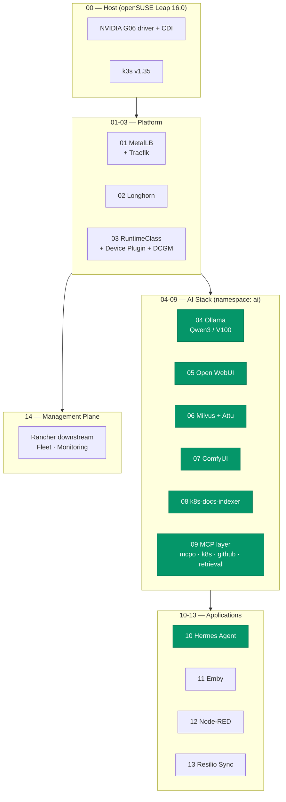
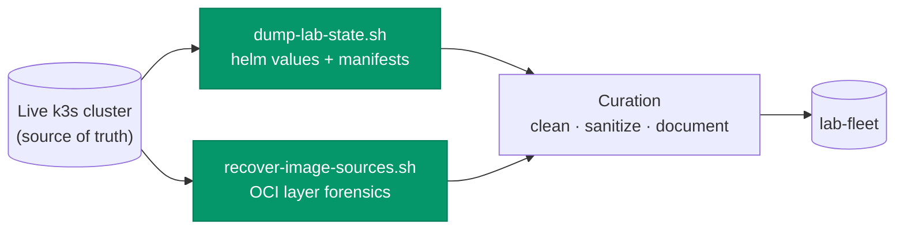

# lab-fleet — Home Lab Cluster Configuration as Code

The complete, install-ordered configuration of a single-node k3s cluster running a private AI platform: local LLM inference on a Tesla V100, RAG over Milvus, agentic MCP tooling, GPU image generation, and the home services that share the node. Every file was curated from **live cluster state** — helm values pulled from running releases, manifests reconstructed from applied objects, and application sources recovered from container image layers after their Dockerfiles were lost.

This repo is mounted as the [`lab/` submodule of ash4d.com](https://github.com/darthzen/ash4d.com), which carries the full architecture documentation. This repo carries the configs.

## Installation Order



## Node Specifications

| Resource | Details |
|---|---|
| **Node** | Single-node k3s (`sdf1`) on openSUSE Leap 16.0 |
| **k3s Version** | v1.35.5+k3s1 (containerd 2.2.3-k3s1) |
| **GPU 0** | NVIDIA Tesla V100 32GB — LLM inference, pinned by UUID to Ollama |
| **GPU 1** | NVIDIA GTX 1070 8GB — ComfyUI (device plugin) + Emby transcode (UUID pin) |
| **Load Balancer Pool** | MetalLB L2, `192.168.7.150-169` |
| **Storage** | Longhorn CSI across all stateful workloads |

## Components

| Step | Component | Chart / Source | Version |
|---|---|---|---|
| 00 | Host prep (NVIDIA G06, CDI, k3s) | zypper / get.k3s.io | k3s v1.35.5+k3s1 |
| 01 | MetalLB + Traefik | metallb/metallb; k3s-bundled traefik | 0.16.1 / 39.0.7 (v3.6.12) |
| 02 | Longhorn | longhorn/longhorn | 1.12.0 |
| 03 | GPU (RuntimeClass, device plugin, DCGM) | nvdp/nvidia-device-plugin | 0.19.2 / dcgm 4.8.2 |
| 04 | Ollama | otwld ollama-helm | chart 1.67.0 (app 0.32.0) |
| 05 | Open WebUI | open-webui/open-webui | chart 14.8.0 (app 0.9.6) |
| 06 | Milvus (+ Attu UI) | zilliztech/milvus | chart 5.0.22 (app 2.6.18) |
| 07 | ComfyUI (+ filebrowser) | mmartial/comfyui-nvidia-docker | latest |
| 08 | k8s-docs-indexer | local image — source in-repo | v2 |
| 09 | MCP layer (mcpo, k8s/github MCP, retrieval-tool) | manifests + in-repo source | — |
| 10 | Hermes agent (Slack AI agent) | nousresearch/hermes-agent | latest |
| 11 | Emby media server (GPU transcode) | emby/embyserver | latest |
| 12 | Node-RED home automation | nodered/node-red | latest |
| 13 | Resilio Sync (P2P file sync) | resilio/sync | latest |
| 14 | Cluster mgmt plane (Rancher downstream) | README only | v2.14.2 |

Each directory contains a README with the exact install commands and the reasoning behind non-default values. Helm components follow one pattern:

```bash
helm upgrade --install <release> <chart> -n <ns> --create-namespace -f <dir>/values.yaml
```

## How This Repo Was Built



Configuration was captured from the running cluster rather than from build-time notes, so it reflects what actually works — including fixes discovered in production (see the emptyDir EBUSY note in `08-indexer/`). The two locally-built images had lost their Dockerfiles entirely; their sources and build recipes were recovered by mounting the image snapshots and reconstructing build history from OCI layer metadata.

**Sanitization:** no kubeconfigs, tokens, or secret values live in this repo. Secrets are referenced via `secretKeyRef` with documented `kubectl create secret` commands and `.example` templates.

## Related Repositories

- [`ash4d.com`](https://github.com/darthzen/ash4d.com) — architecture documentation, deployment plan, and public site; this repo is its `lab/` submodule
- [`ollama-code-mcp`](https://github.com/darthzen/ollama-code-mcp) — MCP server delegating Claude Code tasks to the Ollama instance defined here

## About

Built by [Rick Ashford](https://www.linkedin.com/in/rickashford/) — Sales Engineering leader with 17 years at SUSE, specializing in Kubernetes, Linux, AI/LLM platforms, and open-source ecosystem strategy.
