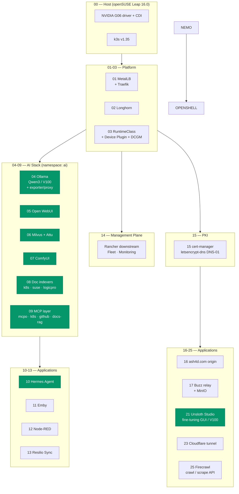
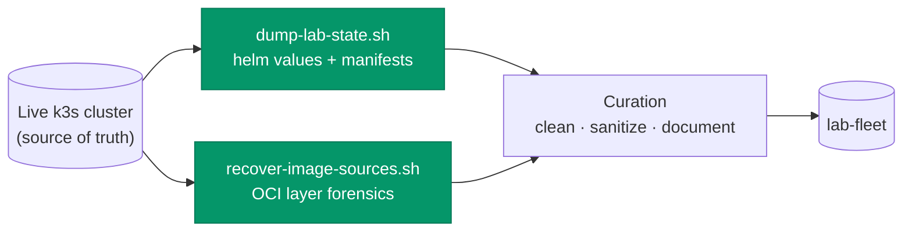

# lab-fleet — Home Lab Cluster Configuration as Code
[](https://app.fossa.com/projects/git%2Bgithub.com%2Fdarthzen%2Flab-fleet?ref=badge_shield)


The complete, install-ordered configuration of a single-node k3s cluster running a private AI platform: local LLM inference on a Tesla V100, RAG over Milvus, agentic MCP tooling, GPU image generation, and the home services that share the node. Every file was curated from **live cluster state** — helm values pulled from running releases, manifests reconstructed from applied objects, and application sources recovered from container image layers after their Dockerfiles were lost.

This repo is mounted as the [`lab/` submodule of ash4d.com](https://github.com/darthzen/ash4d.com), which carries the full architecture documentation. This repo carries the configs.

## Installation Order


```mermaid
flowchart TD
    subgraph host["00 — Host (openSUSE Leap 16.0)"]
        DRIVER[NVIDIA G06 driver + CDI]
        K3S[k3s v1.35]
    end

    subgraph platform["01-03 — Platform"]
        METALLB[01 MetalLB<br/>+ Traefik]
        LONGHORN[02 Longhorn]
        GPU[03 RuntimeClass<br/>+ Device Plugin + DCGM]
    end

    subgraph ai["04-09 — AI Stack (namespace: ai)"]
        OLLAMA[04 Ollama<br/>Qwen3 / V100<br/>+ exporter/proxy]
        OWUI[05 Open WebUI]
        MILVUS[06 Milvus + Attu]
        COMFY[07 ComfyUI]
        INDEXER[08 Doc indexers<br/>k8s · suse · logicpro]
        MCP[09 MCP layer<br/>mcpo · k8s · github · docs-rag]
    end

    subgraph apps["10-13 — Applications"]
        HERMES[10 Hermes Agent]
        EMBY[11 Emby]
        NODERED[12 Node-RED]
        RESILIO[13 Resilio Sync]
    end

    subgraph mgmt["14 — Management Plane"]
        RANCHER[Rancher downstream<br/>Fleet · Monitoring]
    end

    subgraph pki["15 — PKI"]
        CERTMGR[15 cert-manager<br/>letsencrypt-dns DNS-01]
    end

    subgraph more["16-25 — Applications"]
        ORIGIN[16 ash4d.com origin]
        BUZZ[17 Buzz relay<br/>+ MinIO]
        UNSLOTH[21 Unsloth Studio<br/>fine-tuning GUI / V100]
        CFTUNNEL[23 Cloudflare tunnel]
        FIRECRAWL[25 Firecrawl<br/>crawl / scrape API]
    end

    host --> platform --> ai --> apps
    platform --> mgmt
    platform --> pki
    pki --> more
    NEMO --> OPENSHELL

    classDef ai_c fill:#059669,stroke:#047857,color:#fff
    class OLLAMA,OWUI,MILVUS,COMFY,INDEXER,MCP,HERMES,UNSLOTH ai_c
```

## Node Specifications

| Resource | Details |
|---|---|
| **Node** | Single-node k3s (`sdf1`) on openSUSE Leap 16.0 |
| **k3s Version** | v1.35.5+k3s1 (containerd 2.2.3-k3s1) |
| **GPU 0** | NVIDIA Tesla V100 32GB — LLM inference, pinned by UUID to Ollama; also ComfyUI's pin, which is why ComfyUI sits at `replicas: 0` |
| **GPU 1** | NVIDIA GTX 1070 8GB — Emby transcode (UUID pin) |
| **Load Balancer Pool** | MetalLB L2, `192.168.7.150-169` |
| **Storage** | Longhorn CSI across all stateful workloads |

## Components

| Step | Component | Chart / Source | Version |
|---|---|---|---|
| 00 | Host prep (NVIDIA G06, CDI, k3s) | zypper / get.k3s.io | k3s v1.35.5+k3s1 |
| 01 | MetalLB + Traefik | metallb/metallb; k3s-bundled traefik | 0.16.1 / 39.0.7 (v3.6.12) |
| 02 | Longhorn | longhorn/longhorn | 1.12.0 |
| 03 | GPU (RuntimeClass, device plugin, DCGM) | nvdp/nvidia-device-plugin | 0.19.2 / dcgm 4.8.2 |
| 04 | Ollama (+ metrics/proxy exporter) | otwld ollama-helm | chart 1.67.0 (app 0.32.0) |
| 05 | Open WebUI | open-webui/open-webui | chart 14.8.0 (app 0.9.6) |
| 06 | Milvus (+ Attu UI) | zilliztech/milvus | chart 5.0.22 (app 2.6.18) |
| 07 | ComfyUI (+ filebrowser) — scaled to 0 | mmartial/comfyui-nvidia-docker | ubuntu22_cuda12.4.1-latest |
| 08 | Doc indexers (k8s, SUSE, Logic Pro) | local image + ConfigMap scripts | v2 |
| 09 | MCP layer (mcpo, k8s/github MCP, docs-rag MCP) | manifests + in-repo source | — |
| 10 | Hermes agent (Slack AI agent) | nousresearch/hermes-agent | latest |
| 11 | Emby media server (GPU transcode) | emby/embyserver | latest |
| 12 | Node-RED home automation | nodered/node-red | latest |
| 13 | Resilio Sync (P2P file sync) | resilio/sync | latest |
| 14 | Cluster mgmt plane (Rancher downstream + Fleet) | README only | v2.14.3 |
| 15 | cert-manager + `letsencrypt-dns` ClusterIssuer | jetstack/cert-manager | v1.20.2 |
| 16 | ash4d.com origin (nginx placeholder) | raw manifests | nginx-unprivileged:alpine |
| 17 | Buzz relay (+ standalone MinIO) | oci://ghcr.io/block/buzz/charts/buzz | 0.1.6 (app 0.1.0) |
| 21 | Unsloth Studio (fine-tuning GUI) — scaled to 0 | unsloth/unsloth | 2026.5.9 (studio v0.1.43-beta) |
| 23 | Cloudflare tunnel (cloudflared) | raw manifests | cloudflare/cloudflared:2026.7.3 |
| 24 | OpenAI tunnel-client → mempalace MCP | raw manifests | tunnel-client v0.0.11 |
| 25 | Firecrawl self-hosted crawl/scrape API | raw manifests (upstream k8s example, adapted) | 2.11.227 |

### Directory numbers 15+ are append-order, not install-order

`15`–`22` were added after the original `00`–`14` tree and are numbered in the
order they were adopted, not their true position in a dependency graph.
**cert-manager (15) actually installs before almost everything** — it issues the
TLS for `attu` (06), `hermes` (10) and `registry`, so on a
rebuild it belongs alongside `01`–`03`. It was appended rather than inserted
because renumbering the existing tree would invalidate every Fleet `GitRepo`
path and every cross-reference in the docs, for a cosmetic gain.

Real dependency order for the new components:

    15-cert-manager  →  16, 17, 21, 25  (anything terminating TLS in-cluster)

Buzz (17) was briefly vendored too, on a wrong conclusion that its chart was
unpublished; it is now referenced upstream at an immutable `0.1.6`. See
`14-cluster-mgmt/FLEET-WIRING.md` for both stories.

Each directory contains a README with the exact install commands and the reasoning behind non-default values. Helm components follow one pattern:

```bash
helm upgrade --install <release> <chart> -n <ns> --create-namespace -f <dir>/values.yaml
```

## How This Repo Was Built


```mermaid
flowchart LR
    CLUSTER[("Live k3s cluster<br/>(source of truth)")]
    DUMP[dump-lab-state.sh<br/>helm values + manifests]
    FORENSICS[recover-image-sources.sh<br/>OCI layer forensics]
    CURATE[Curation<br/>clean · sanitize · document]
    REPO[("lab-fleet")]

    CLUSTER --> DUMP --> CURATE
    CLUSTER --> FORENSICS --> CURATE
    CURATE --> REPO

    classDef tool fill:#059669,stroke:#047857,color:#fff
    class DUMP,FORENSICS tool
```

Configuration was captured from the running cluster rather than from build-time notes, so it reflects what actually works — including fixes discovered in production (see the emptyDir EBUSY note in `08-indexer/`). The two locally-built images had lost their Dockerfiles entirely; their sources and build recipes were recovered by mounting the image snapshots and reconstructing build history from OCI layer metadata.

**Sanitization:** no kubeconfigs, tokens, or secret values live in this repo. Secrets are referenced via `secretKeyRef` with documented `kubectl create secret` commands and `.example` templates.

## Related Repositories

- [`ash4d.com`](https://github.com/darthzen/ash4d.com) — architecture documentation, deployment plan, and public site; this repo is its `lab/` submodule
- [`ollama-code-mcp`](https://github.com/darthzen/ollama-code-mcp) — MCP server delegating Claude Code tasks to the Ollama instance defined here

## About

Built by [Rick Ashford](https://www.linkedin.com/in/rickashford/) — Sales Engineering leader with 17 years at SUSE, specializing in Kubernetes, Linux, AI/LLM platforms, and open-source ecosystem strategy.


## License
[](https://app.fossa.com/projects/git%2Bgithub.com%2Fdarthzen%2Flab-fleet?ref=badge_large)